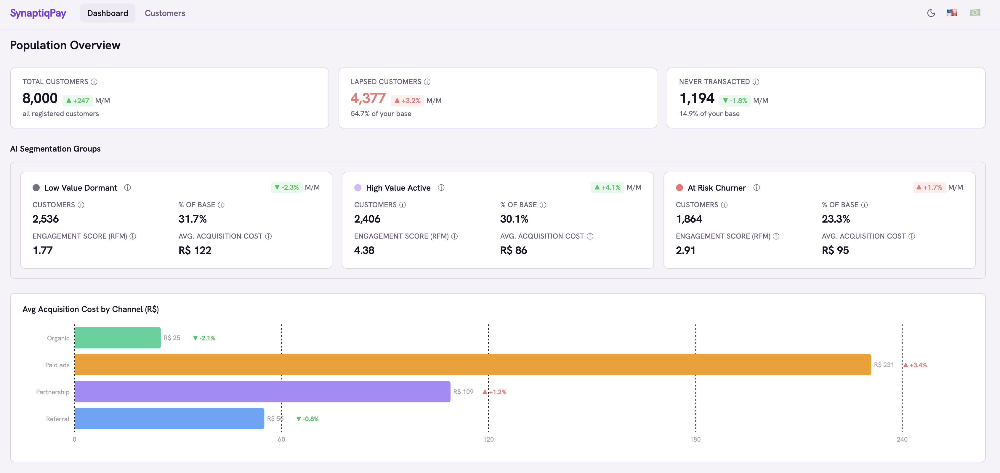
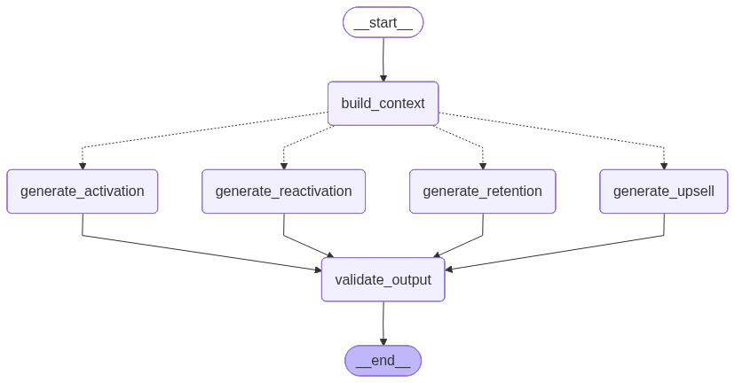

  <p align="center">
  
</p>

<h1 align="center">SynaptiqPay — AI Customer Segmentation</h1>

<p align="center">
  An AI system that turns behavioral segments into a personalized next action for every customer.
</p>

<p align="center">
  <a href="https://fintech-ai.up.railway.app">Live Demo</a> &nbsp;·&nbsp;
  <a href="https://fintech-ai.up.railway.app/dashboard">Dashboard</a> &nbsp;·&nbsp;
  <a href="https://fintech-ai.up.railway.app/customers">Try the Agent</a>
</p>

---

## The Problem

SynaptiqPay is a Brazilian fintech with 8,000 digital wallet customers. The commercial team had rich transaction data but no clear way to segment the base or decide what to offer each person. Every customer received the same treatment — same offers, same communication, same retention strategy — regardless of whether they were highly engaged, quietly drifting, or already gone.

That changed here.

---

## What Was Built

A machine learning segmentation model groups customers by behavior. Those segments — alongside RFM scores, cohort health, and product ownership signals — feed into an AI agent that recommends the right action for each customer.

On top of that, a business dashboard gives the commercial team a live view of segment health and KPI evolution. No SQL, no spreadsheets.

<p align="center">
  
</p>

---

## How It Works

The analysis follows a discovery-first path. Each step builds on the previous one.

**01 — Who do we have?**
Demographic analysis covering age distribution, acquisition channels, and CAC by channel. Product ownership as a first behavioral signal.

**02 — How do they behave over time?**
Cohort retention at M3 and M6 horizons. Channel quality ranking. Behavioral heterogeneity, recency risk tiers, and churn proxies.

**03 — What do we know about each customer?**
RFM scoring (Recency, Frequency, Monetary) distills transaction history into comparable signals. K-Means clustering (unsupervised, k=3) identifies operational segments from behavioral patterns alone — no labels used as input.

**04 — What should we do about it?**
A LangGraph agent receives each customer's full profile and returns a structured recommendation: what to offer, what tone to use, and why.

<p align="center">
  
</p>

---

## The AI Recommendation Agent

The agent routes each customer to one of four strategy branches based on their segment and lifecycle stage, then calls an LLM via OpenRouter to generate a grounded recommendation.

<p align="center">
  
</p>

**Input — what the agent receives per customer:**

```json
{
  "customer_name": "Ana Souza",
  "cluster_name": "at_risk_churner",
  "cluster_position": "bottom_20",
  "lifecycle_stage": "dormant",
  "rfm_score": 1.4,
  "cluster_avg_rfm": 1.61,
  "recency_score": 1,
  "frequency_score": 1,
  "monetary_score": 2,
  "recency_days": 92,
  "products_owned": "wallet",
  "acquisition_channel": "paid_ads",
  "acquisition_cost": 280.0,
  "tenure_months": 8,
  "activity_trend": "2025-07: 3 tx (R$42); 2025-08: 1 tx (R$15)"
}
```

**Output — what the agent returns:**

```json
{
  "risk_level": "critical",
  "recommended_action": "immediate retention offer",
  "suggested_product": "cashback credit card",
  "message_tone": "urgent, empathetic",
  "notification_text": "Exclusive offer just for you — unlock cashback on every purchase today.",
  "reasoning": "Registered via paid_ads 8 months ago (R$280 CAC). Low RFM, 92 days silent, wallet only. Credit card offer could reactivate before churn.",
  "strategy_used": "retention"
}
```

All fields are Pydantic-validated. The agent's reasoning is grounded in the customer's actual data — not generic copy.

---

## Tech Stack

| Layer | Technology | Purpose |
|---|---|---|
| Data generation | Faker (pt_BR) | Synthetic Brazilian customer dataset with planted behavioral segments |
| Data manipulation | Pandas + Jupyter | EDA, cohort analysis, RFM scoring |
| Machine learning | Scikit-learn | K-Means clustering (k=3 operational segments) |
| AI agent | LangGraph + Pydantic | Conditional 4-route graph, structured output |
| LLM | OpenRouter | Routes to Gemini Flash, Llama 70B, or smart-auto |
| Observability | LangSmith | LLM tracing, latency monitoring, run inspection |
| Backend | FastAPI | REST API connecting data and agent to the frontend |
| Frontend | React + Vite + Tailwind + shadcn/ui + Recharts | Business dashboard |
| Database | Supabase (PostgreSQL) | Raw tables + customer_analysis analytical mart |
| ORM | SQLAlchemy | Parameterized queries, no SQL injection surface |
| Containerization | Docker + Docker Compose | Local and VPS orchestration |
| Deployment | Railway | Auto-deploy on push (frontend + backend) |
| Dependency management | Poetry | Reproducible Python environment |

---

## Running Locally

**Prerequisites:** Python 3.11+, Poetry, Node 18+

```bash
# Clone and install backend dependencies
git clone https://github.com/pauloabcalcada/fintech-ai-segmentation
cd fintech-ai-segmentation
poetry install --with dev
```

Create a `.env` file at the project root with:

```
SUPABASE_DATABASE_URL=your_supabase_postgres_url
OPENROUTER_API_KEY=your_openrouter_key
LANGSMITH_API_KEY=your_langsmith_key        # optional, for tracing
```

```bash
# Start the backend (from project root)
PYTHONPATH=src .venv/bin/uvicorn fintech_ai_segmentation.app.main:app --reload

# Start the frontend (from project root, in a separate terminal)
npm --prefix frontend install
npm --prefix frontend run dev
```

The dashboard will be available at `http://localhost:5173`.

---

## Roadmap

| Phase | Title | Status |
|---|---|---|
| **Phase 1** | MVP — dataset, EDA, clustering, AI agent, dashboard, Railway deploy | ✅ Shipped |
| **Phase 2** | Intelligence Layer — text-to-SQL chatbot, auto-generated charts, read-only guardrails | 🔄 Active |
| **Phase 3** | BI Expansion — LTV/CAC deep-dive, churn prediction model, feature importance | Planned |
| **Phase 4** | Pipeline Automation — scheduled ETL, K-Means retraining, drift alerting, cluster monitoring | Planned |

---

## Links

- Live demo: [fintech-ai.up.railway.app](https://fintech-ai.up.railway.app)
- LinkedIn: [linkedin.com/in/paulo-calcada](https://linkedin.com/in/paulo-calcada)
- Email: pauloabcalcada@gmail.com

---

<p align="center">
  Built on a fully synthetic dataset. Every customer, transaction, and identity was generated with Faker and maps to no real person.
</p>
