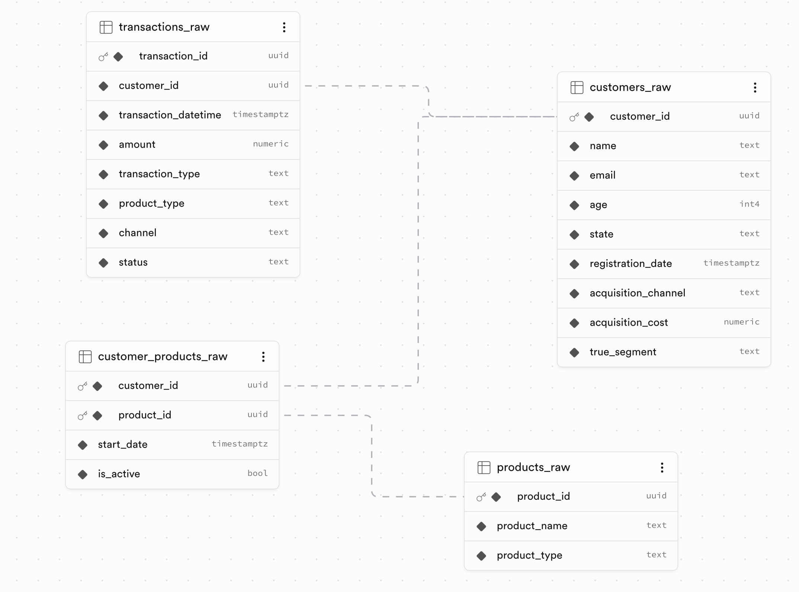

## Fintech AI Segmentation – Project Journey

This file is a concise, storytelling log of how we are building the Fintech AI Segmentation project. It is written as if explaining the project to a curious data/ML practitioner or hiring manager and can be reused directly for LinkedIn posts or portfolio write-ups.

SynaptiqPay is a Brazilian fintech with 8,000 digital wallet customers, but their commercial manager still treats everyone the same — identical offers, communication, and retention tactics. This one-size-fits-all approach wastes time and money because some customers are highly engaged and profitable, while others are dormant or close to churning. Our goal with this project is to replace weekly spreadsheet firefighting with a segmentation- and AI-driven workflow that surfaces who the customers are, how they behave, how valuable they are, who is at risk, and which concrete action the manager should take next.

---

## Prompt template for new entries

Use this structure whenever adding a new journey update:

1) What was discussed
2) What was learned
3) What was implemented/changed
4) Key takeaways

Suggested prompt:
"Create a new `project-journey` entry in teaching tone, dated `YYYY-MM-DD` with a short title. Focus on:
1) the key decisions we made
2) why we made them (trade-offs and reasoning)
3) the business insights we extracted
4) what we learned through iterations.
Keep it concise, realistic, and business-relevant. Avoid low-level implementation details unless they are essential to the decision story."

---

### 2026-03-18 — Kicking off the project journey log

Today we created a dedicated `project-journey` log to track the main steps in building the Fintech AI Segmentation project. Instead of burying decisions inside notebooks or long chats, this file will capture the narrative: problem framing, modeling choices, data design, engineering decisions, and what we learned along the way. The goal is to keep each update short and “LinkedIn-ready”, so that any entry can be turned into a post with minimal editing. This also forces us to explain our work in plain language, as if we were teaching a colleague who understands data but has not seen the code.

### 2026-03-18 — Designing the first ELT step with synthetic data

Today we took the first practical step of the ELT pipeline by designing synthetic “faker” datasets that mirror the four planted behavioral segments (`high_value_active`, `mid_value_regular`, `low_value_dormant`, and `at_risk_churner`) and the business questions we care about. Instead of randomly generating noise, we shaped fields, distributions, and event patterns so that high-balance, very engaged customers look meaningfully different from low-balance, dormant, and at-risk churners, making it possible to recover these ground-truth segments later through EDA, RFM, clustering, and churn modeling. We are saving each dataset as a CSV file so it can act as the extraction layer of a realistic ELT workflow, decoupled from any one warehouse or BI tool. The next step will be setting up Supabase as our analytical database so we can load these CSVs, enforce a clean base schema, and run the segmentation and churn analysis with SQL and Python on top of a more production-like environment.

### 2026-03-20 — Importing `transactions_raw` with size-aware chunking

Today we moved from the “synthetic data” stage to the database loading stage by creating the raw tables in Supabase and then focusing on the hardest dataset in `data/raw`: `transactions_raw.csv`. We first explored loading everything through Supabase MCP (create tables via `apply_migration`, then insert data via SQL), but ran into practical obstacles once the payload got large—batching required generating big `INSERT` statements, and even after iterating on batch sizes the tool-side transmission/payload caps made it unreliable to send batches at scale. We also attempted the “Option A” approach (`psql` + `\copy`) as a cleaner bulk-load alternative, but our environment hit a DNS issue resolving the Supabase DB host, so that path wasn’t usable immediately. To keep progress unblocked while staying within Supabase’s dashboard constraints, we switched strategies: we sliced `transactions_raw.csv` into three CSV files (each under ~100MB) and verified row counts/headers for each slice. This choice turned the problem from “how do we push 1.8M+ rows through a chat-style SQL channel” into “how do we use a purpose-built import UI with predictable chunk sizes,” which is exactly what the rest of the ELT pipeline needs.

After creating the four raw tables (`customers_raw`, `products_raw`, `transactions_raw`, and `customer_products_raw`) and loading the CSV data, we validated that the database schema matches our intended data model (primary keys, foreign keys, and the expected column types). The screenshot below is our reference point for what “done” looks like in Supabase’s table view: it confirms that the raw ingestion layer is structurally correct and ready for the next SQL-based segmentation steps.

### 2026-03-23 — Improving synthetic data realism and freezing EDA outputs

Today we focused on making the synthetic customer base more believable before moving into the next analysis cycle. We updated generation assumptions to better reflect Brazilian market concentration by state (with stronger weight in the Southeast), improved identity quality by generating unique customer names and name-linked emails, and intentionally resized the dataset while preserving the planted segment mix. This matters because many downstream business questions (especially channel and geography decisions) are only as credible as the realism of the raw inputs.

In parallel, we strengthened the EDA narrative so it explicitly connects observed plots to generator assumptions. We added diagnostics for skewness/kurtosis, state distribution caveats, segment and channel proportion checks versus intended design, and segment-level acquisition-cost comparisons. The key lesson is that synthetic projects become much more interview- and production-ready when assumptions are transparent and testable in the notebook, instead of being hidden in generation code.

Finally, we introduced a “freeze” workflow for reproducibility by creating a dated snapshot of the EDA notebook and exporting it to HTML. This gives us a stable historical report we can reference after regenerating/loading new data versions, without losing today’s baseline results or narrative context.

### 2026-03-25 — STEP 1 EDA, channel economics, transactions aggregates, and aligned generation

Today we iterated on the STEP 1 “Who do we have?” EDA after reloading the updated v2 dataset into Supabase. We verified that the base extract is consistent: schema and data types look correct, nulls are absent, and the v2 fixes (state sampling realism and unique, consistently paired name/email identities) hold up in the loaded table.

Beyond correctness, we improved the notebook’s usability as an analytical instrument: we reorganized content into a clear Part 1/Part 2 flow, added reliable in-notebook navigation (numbered items and jump links), and built additional business-oriented cross-slices (channel × state, channel × age bands, channel × CAC preview, and state × age structure restricted to the top states). The key learning was that synthetic artifacts (like roughly flat monthly signups) can appear realistic while still being generator-driven, so the EDA must document interpretation rules—not just show charts.

Finally, we tightened robustness during analysis by addressing compatibility and plotting issues early. This makes the EDA a dependable foundation for later LTV/CAC and churn steps, where small upstream mismatches can otherwise cascade into misleading unit economics or retention conclusions.

We redesigned the acquisition-cost logic so unit economics emerge from channel strategy instead of being implicitly tied to segment averages. We introduced explicit channel CAC profiles (`organic`, `referral`, `partnership`, `paid_ads`) with different means and spreads, and aligned channel-to-segment behavior with a clear bias model. This makes the synthetic story much closer to how growth teams think in practice: channels have different cost structures, and those channels attract different customer quality mixes.

A key implementation lesson was operational, not just statistical: changing customer generation blindly can break downstream foreign-key relationships when IDs are already loaded in the warehouse. To avoid that, we switched to a safe update path that preserves existing `customer_id` values and updates only acquisition fields in place. This protected `transactions_raw` and `customer_products_raw` links while still letting us deploy the new economics assumptions in Supabase.

We also updated the STEP 1 EDA narrative so interpretation matches the new design: CAC is now validated at the channel level, channel-segment mix is explained as business logic (not random variation), and geography commentary now distinguishes composition effects from channel policy. The broader insight is that synthetic data projects become much more credible when modeling assumptions, warehouse constraints, and notebook storytelling are all kept in sync.

We extended the pipeline into **Notebook 2 — Transactions EDA and monthly aggregates**, wiring `transactions_raw` to `customers_raw` in Supabase (completed transactions only), building transaction months and per-customer monthly spend and activity counts, and documenting the notebook in the same Part-based style with jump links as STEP 1. On top of that foundation we added a first “who is most valuable now?” slice and implemented **M0–M3 strict-streak cohort retention** overall and by acquisition channel—directly feeding the roadmap questions on when cohorts disengage and which channels bring stickier customers. The lesson for the journey is that time-based behavior belongs in its own notebook layer: it keeps cohort and RFM work from being mixed into customer demographics, and it makes the later LTV and churn steps reuse clear, testable aggregates instead of one-off SQL.

In the same pass we kept **Notebook 1** in sync with the evolving customer-generation story and adjusted **`faker_base_generation.py`** so synthetic outputs stay aligned with the channel economics and identity rules we validated in the warehouse—so generation code, Supabase data, and both EDA notebooks continue to tell one coherent story.

### 2026-03-27 — Building cohort analysis as a decision layer

Today we expanded the transactions notebook into a full **EDA cohort analysis** layer that can answer business questions directly, not just describe time-series trends. We moved from simple monthly curves to a registration-based cohort framework with horizon checkpoints (**M3** and **M6**), strict-streak KPIs, and eligibility-aware denominators so each metric is compared on a fair observation window. We also added a tenure drop-off view to identify where disengagement concentrates and a channel-quality ranking to compare acquisition sources on durability, not just volume.

The most important design choice was denominator clarity. We kept the cohort roster anchored on all registered customers, then marked activity by completed transactions. This made one key lesson explicit: depending on the business question, “retention” can mean cohort quality rate, absolute retained users, or month-to-month decay, and each requires a different denominator and interpretation. That framing prevents common mistakes like over-celebrating high rates on tiny cohorts or misreading partial-month data as a real downturn.

From a business perspective, this notebook now acts as a bridge between descriptive EDA and action planning. It supports channel-budget decisions with M6-first quality comparisons, highlights the timing window where lifecycle interventions should focus, and prepares clean, reusable cohort features for downstream RFM, unit economics, and churn modeling.

### 2026-04-01 — Fixing the product-type mismatch and rebuilding the data pipeline

We discovered that `transactions_raw` was only ever producing two `product_type` values — `wallet` and `credit_card` — even though the product catalog and the customer-ownership bridge table had five types (investment, insurance, and loan as well). The root cause was a channel-first assignment: channel was drawn first and then deterministically mapped to one of two product types, completely ignoring what products each customer actually owned. Beyond generating misleading data, the generation order was also wrong: transactions were built before customer-product ownership existed, so there was nothing to link them to.

We fixed this by inverting the logic. `customer_products_raw` is now generated before `transactions_raw`, a per-customer active-product map is built from that bridge table, and each transaction's `product_type` is sampled from the customer's own product portfolio. Channel is then drawn conditionally on product type (e.g. credit card transactions favor physical and online channels; loans and investments favor in-app). We also added a `validate_base_tables_consistency()` function that runs automatically on every generation, asserting that every transaction's product type is in the catalog and belongs to an active product for that customer. This is a good example of why data contract validation should sit as close to generation as possible — the mismatch had been silently present since the beginning.

### 2026-04-01 — Replacing scattered transaction dates with a month-by-month dropout model

After fixing the product-type mismatch, we noticed two related problems in the cohort retention analysis. First, the overall M3/M6 active rates were above 90% across all segments, which made it impossible to distinguish a high-value active customer from a dormant one by behavior alone. Second, the retention curve showed an extreme M0 → M1 jump: registration-month activity was almost zero, then M1 exploded. Both problems shared the same root cause: the old generator drew all transactions for a customer's entire tenure in a single Poisson sample and then scattered them uniformly across months via a Beta distribution. With 4–40 expected transactions per month, the probability of any calendar month being empty was near zero, so every customer looked active every month.

We replaced this with a realistic **month-by-month dropout model**. For each calendar month, the customer either transacts (Bernoulli trial with a segment-specific `p_active_per_month`) or stays silent. If active, they generate a Poisson number of transactions placed on random days within that month. `p_active` is 95% for high-value customers, 85% for mid-value, 40% for dormant, and 25% for at-risk churners, with an exponential decay applied to the churn-prone segments so their activity concentrates early in tenure. This produces the segment separation that makes the cohort analysis meaningful: M3 active rates are now ~96% for high-value, ~84% for mid-value, ~38% for dormant, and ~21% for churners.

We also fixed the M0 partial-month problem. Transactions now begin on `registration_date` rather than the first of the month, so both `p_active` and `avg_tx` are pro-rated by the fraction of the month remaining. A customer who registers on the 1st gets a nearly full M0; one who registers on the 28th gets a short window. This removed the artificial M0 suppression and made `transactions_raw` consistent with `customer_products_raw`, whose product start dates were already anchored to `registration_date`.

### 2026-04-01 — Adding permanent churn and replacing the Supabase loading workflow

With the monthly dropout model in place, aggregate transaction volume still grew linearly over the 24-month window because dormant and at-risk customers kept generating sparse transactions indefinitely — they had no way to permanently exit. We added a **Geometric survival model**: at the start of each customer's tenure, a churn month is drawn from a segment-specific hazard rate (0.4% per month for high-value, 2% for mid-value, 8% for dormant, 18% for churners). Once that month is reached, `p_active` permanently drops to zero. This creates realistic right-censored churn behavior: most high-value customers never churn within the 24-month window, while ~90% of at-risk churners exit within a year.

In parallel, we replaced the manual Supabase UI upload workflow with a scripted shell approach. Splitting `transactions_raw.csv` into three part files for the UI was taking 15–21 minutes and was blocked by statement-timeout errors when clearing old data. We built `scripts/load_raw_tables.sh`, which terminates competing connections, drops and recreates all four tables in FK-correct order, and bulk-loads the full (unsplit) CSV files via PostgreSQL's native `COPY` protocol — reducing total reload time to roughly 30–90 seconds. The key insight is that the Supabase UI routes through the PostgREST HTTP layer and enforces short statement timeouts, while a direct `psql` connection bypasses both constraints entirely.

### 2026-04-02 — Tightening cohort EDA: comparable windows, clearer stories, and honest statistics

We sharpened the cohort notebook so leadership questions are answered with **explicit rules** instead of implicit defaults. Activity used in retention grids is filtered to a **defined comparison window** aligned with the “safe core” cohort period, while the customer roster stays full-funnel—so denominators stay honest and we avoid pretending early or incomplete months are comparable to mature cohorts. Calendar-time charts gained richer commentary: **TPV** and **MAU** are read alongside **seasonality**, **channel mix**, and **plateau risk**, not as a single vanity curve.

On the analytics side, we moved from “eyeball the line chart” to **structured comparisons**: boxplots of M3/M6 and strict-streak rates split by **first vs second half** of the window, plus **permutation tests** as an exploratory check—with the caveat that **time-ordered cohorts are not exchangeable**, so p-values support intuition, not causal proof. The **aggregate tenure curve** is now documented properly: the **M0→M1** jump reflects delayed first use more than “bad signups,” and the **steepest post-activation step-down** is **M2→M3**, which points lifecycle investment at a concrete window. **Channel-level rolling views** (strict streak vs M6 active) are paired with actionable governance: Referral as the quality benchmark, Paid as an audit-and-thresholds problem, Partnership and Organic when the two panels disagree.

We closed the loop by **rewriting the notebook summary** so roadmap questions Q2–Q5 match this discipline: **quality vs volume** rankings need different reading, **aggregate “recent vs old”** is inconclusive without segmentation and uncertainty, and **channel** splits answer “who is healthy” better than a blended line. The meta-lesson is that **fintech retention storytelling fails when you mix scale, maturity, and mix shift**—explicit windows, eligibility, and segment cuts turn charts into decisions.

### 2026-04-02 — Faker for identity, statistical models for behavior and history

We clarified how the synthetic stack splits responsibilities: **Faker (`pt_BR`)** supplies believable identities—names and emails tied together—while **transaction history** is not “random faker events” but a deliberate sequence of distributions (registration timing, monthly activity, counts, product choice, and permanent churn). That separation matters because interviewers and stakeholders often assume “fake data” means unstructured noise; here, ground-truth segments and cohort stories only work because **time and money** are generated with explicit rules.

Over the project we repeatedly **changed distributions** when the business narrative broke: acquisition moved toward a **Gamma-shaped** signup curve so the portfolio feels mature in the observation window; transactions moved from **Poisson totals scattered across months** (which made almost everyone active every month) to **month-by-month Bernoulli activity**, **Poisson counts when active**, **partial-month pro-rating from `registration_date`**, and finally **geometric survival** so some customers truly stop. The insight is that **history** in `transactions_raw` is the hardest layer to get right—once monthly silence and exit exist, dormant and at-risk segments become visible in cohorts without hand-waving in the notebook.

### 2026-04-07 — Hardening the clustering feature space for business-ready segmentation

Today we moved from “feature list assembly” to feature-space quality control for clustering. We redesigned the monetary signal by introducing **avg ticket** (value per transaction) so frequency and spend no longer double-count the same behavior, and we added **tenure_days** from registration date to capture lifecycle maturity explicitly. This matters for the business because commercial actions differ by maturity stage: a new customer with recent activity needs onboarding acceleration, while a long-tenure customer with similar recency may need retention or upsell logic.

We also strengthened preprocessing discipline instead of adding complexity too early. We kept a targeted transform strategy (`log1p` for heavy-tailed variables, `sqrt` for bounded refund rate) and added notebook diagnostics that expose correlation and distribution shape before modeling. A practical lesson emerged: when sklearn transformers reorder columns by transform group, summary tables can silently mislabel metrics unless output columns are aligned deliberately. Fixing that alignment prevented wrong interpretations (like apparent jumps in max values) and made the EDA trustworthy again.

The key takeaway is that segmentation quality depends as much on **feature semantics and diagnostic rigor** as on the clustering algorithm itself. By tightening definitions (avg ticket vs total spend), adding lifecycle context (tenure), and validating preprocessing outputs end-to-end, we set up a more stable and explainable path for the next K-means evaluation step.

### 2026-04-08 — Converging on an operational clustering blueprint

We made a key modeling decision: keep **k-means with `k=3`** as the operational segmentation baseline, even though internal metrics can sometimes favor a lower `k`. The reason is business usefulness: three clusters preserve enough behavioral contrast to support differentiated CRM strategies while still remaining interpretable for stakeholders.

We also chose to formalize transaction-mix behavior as part of the core feature definition, not as an optional side experiment. That decision came from iteration: intensity variables alone (recency, frequency, ticket) explained activity volume but not always customer intent, while mix shares clarified how customers actually use the wallet. The business insight is that segmentation quality improves when we capture both **how much** customers transact and **how** they transact.

Another important learning was methodological: unsupervised segmentation should not be forced to mirror synthetic label counts, and analysis should stay anchored to a defined business window rather than all historical data. This keeps decisions comparable over time and closer to production reality, while leaving a clear path for future improvement through richer temporal features, stability checks, and alternative clustering algorithms.

### 2026-04-09 — Turning clusters into product activation strategy

Today we stress-tested the cluster design by trying richer inputs (product-type amount shares and acquisition-channel encoding), comparing scaled, unscaled, mixed, and PCA variants, and then running feature ablations. The headline insight was that better geometric separation does not automatically mean better business segmentation: some variants produced cleaner metric scores but less actionable cluster stories.

We then anchored the analysis back on the standard `k=3` behavioral clusters and added a product lens built for decisions: product penetration, product activity, and activation gap by cluster. A key correction was denominator integrity (full customer × product grid), plus a stricter activity definition of at least one transaction in the last six months, which turned the gap metric into a practical read of recent under-activation.

The outcome is a clearer operating model for CRM: one engaged core segment and two lower-engagement segments with distinct usage intent (purchase-first vs transfer-led). The lesson is that cluster interpretation gets much stronger when we pair behavior-space segmentation with product-level activation diagnostics, instead of treating clustering metrics as the final answer.

We turned the clustering notebook from an analysis-only artifact into something **downstream systems can query**: a single **`customer_analysis`** table in Supabase that joins **`customers_raw`** attributes, the **engineered RFM feature matrix**, **global transaction facts** (first and last activity across all completed history), and **two complementary labels**—a rule-based **lifecycle stage** for the full roster and **`k=3` cluster names** only where k-means was actually fit (customers with qualifying window activity). That matters because CRM and models need one spine row per customer, but clustering is only meaningful for customers represented in the feature space; mixing “unclustered” rows into fake cluster IDs would silently break governance.

We documented the build inline: **Part 4** explains the two-layer design, and a **column map** spells out what was aggregated on top of the original customer pull versus what stays static from the warehouse. The practical lesson is that **production segmentation is usually governance plus modeling**: eligibility and lifecycle rules for everyone, and unsupervised segments only for the population the algorithm saw—anything else needs different playbooks (onboarding, win-back, or product activation) instead of a cluster label.

### 2026-04-13 — Turning cohort EDA into decision-ready signals

Today we upgraded Notebook 2 from a visual EDA pass into a more decision-ready business analysis flow. We tightened multiple sections so they remain stable across reruns (timezone-safe date handling, self-contained reference dates, and robust joins), then improved chart readability and ordering so channel quality and lifecycle risk are easier to interpret. This matters because the notebook is now more reliable as an operating document, not just an exploration scratchpad.

A key learning came from the churn-proxy section: a flat failure-rate chart looked “correct” but was not informative, because status probabilities are mostly fixed in the synthetic generator. We replaced that with a stronger metric—90+ day silence by tenure at last activity—so the analysis highlights where retention risk actually concentrates across the lifecycle. The practical takeaway is clear: early-tenure interventions (activation, pre-90-day save journeys, and channel quality guardrails) are where the largest retention ROI sits.

### 2026-04-14 — Making Notebook 3 robust, interpretable, and easier to operate

Today we tightened the RFM clustering notebook so it behaves predictably across reruns and tells a clearer modeling story. We fixed k-selection plumbing (explicit `k` sweeps and stable best-config handoff), removed brittle assumptions around intermediate variables, and clarified the PCA visualization so the chart reflects what the model actually used versus what is only a 2D projection for display. This matters because segmentation notebooks often fail in practice due to execution-order fragility, not algorithm choice.

We also made a concrete feature-space governance decision: prune strongly collinear behavioral columns before clustering, then document the rationale in the notebook itself. Instead of letting redundant monetary and activity-coverage features over-weight one latent axis in Euclidean distance, we kept a leaner set that preserves level, mix, and trajectory signals with less duplication. The key lesson is that in unsupervised segmentation, interpretability and distance geometry must be designed together—cleaner inputs usually produce clusters that are both more stable and more actionable for CRM decisions.
